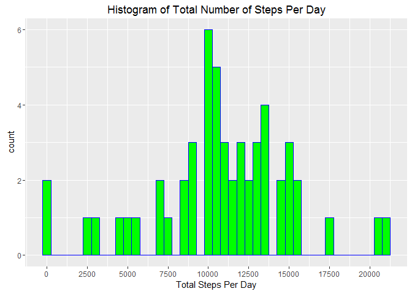
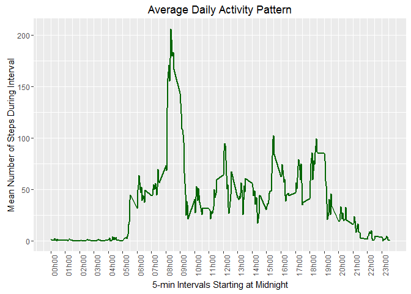
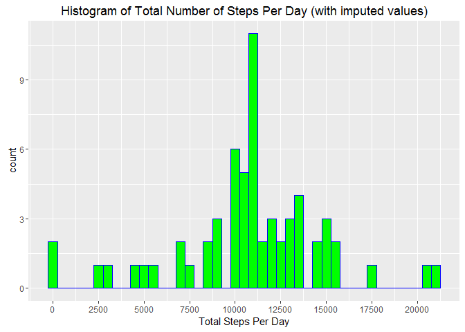
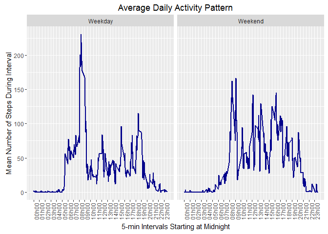

Loading and Preprocessing the Data
==================================

1.  Load required libraries

<!-- -->

    library(dplyr)
    library(dtplyr)
    library(data.table)
    library(ggplot2)

1.  Read the data from the supplied .csv file

<!-- -->

    # Read the data
    setwd("C:/home/Data-Science-Course/Reproducible-Research/Course-Project-1")
    activity <- read.csv("activity.csv")

1.  Do a little preprocessing of this data

<!-- -->

    # Convert the data frame to a data.table
    activity <- tbl_dt(activity)
    # Convert the date variable from character to Date
    activity$date <- as.Date(as.character(activity$date))

What is mean total number of steps taken per day?
=================================================

1.  Calculate the total number of steps per day

<!-- -->

    # (Ignore NA values)
    total_steps_per_day <- activity %>% na.omit() %>% group_by(date) %>% summarise(.,sum=sum(steps))

1.  Plot the result as a histogram

<!-- -->

    ggplot(data=total_steps_per_day,aes(sum)) + geom_histogram(binwidth=500,col="blue",fill="green") + scale_x_continuous(breaks=seq(0,max(total_steps_per_day$sum),by=2500)) + labs(title="Histogram of Total Number of Steps Per Day",x="Total Steps Per Day")

1.  Calculate and report the mean and median of the total number of
    steps taken per day

<!-- -->

    summary(total_steps_per_day$sum)

    ##    Min. 1st Qu.  Median    Mean 3rd Qu.    Max. 
    ##      41    8841   10760   10770   13290   21190

What is the average daily activity pattern?
===========================================

1.  Create a function "hackInterval()" that will generate nice x-axis
    labels representing 24-hour (a.k.a. "metric") time

<!-- -->

    hackInterval <- function(interval) {
        interval <- as.character(interval)
        num_chars <- nchar(interval)
        if(num_chars==1) {
            mod_interval <- "00h0"
            mod_interval <- paste(mod_interval,interval,sep="")
        }
        else if(num_chars==2) {
            mod_interval <- "00h"
            mod_interval <- paste(mod_interval,interval,sep="")
        }
        else if(num_chars==3) {
            split_interval <- strsplit(interval,'(?=^\\d{1}(?=\\d{2,}))',perl=T)[[1]]
            leading <- split_interval[1]
            trailing <- split_interval[2]
            mod_interval <- paste("0",leading,sep="")
            mod_interval <- paste(mod_interval,"h",sep="")
            mod_interval <- paste(mod_interval,trailing,sep="")
        }
        else if(num_chars==4) {
            lead_pattern <- "(^\\d{2})"
            trail_pattern <- "(\\d{2}$)"
            m_lead <- regexec(lead_pattern,interval)
            leading <- regmatches(interval,m_lead)[[1]][1]
            m_trail <- regexec(trail_pattern,interval)
            trailing <- regmatches(interval,m_trail)[[1]][1]
            mod_interval <- paste(leading,"h",sep="")
            mod_interval <- paste(mod_interval,trailing,sep="")
        }
        mod_interval
    }

1.  Create a data frame with the mean number of steps per 5-minute
    interval calculated (uses the hackInterval() function defined above)

<!-- -->

    activity_for_plotting2 <- activity %>% group_by(interval) %>% na.omit() %>% select(steps,date,interval) %>% summarise(mean_num_steps=mean(steps)) %>% rowwise() %>% mutate(mod_interval=hackInterval(interval))

1.  Plot the mean daily activity pattern (ignoring NAs) as a time series

<!-- -->

    ggplot(data=activity_for_plotting2,aes(interval,mean_num_steps)) + geom_line(color="darkgreen",size=1) + xlab("5-min Intervals Starting at Midnight") + ylab("Mean Number of Steps During Interval") + scale_x_continuous(breaks=activity_for_plotting2$interval[seq(1,length(activity_for_plotting2$interval),12)],labels=activity_for_plotting2$mod_interval[seq(1,length(activity_for_plotting2$mod_interval),12)]) + theme(axis.text.x = element_text(angle = 90, hjust = 1)) + ggtitle("Average Daily Activity Pattern")

1.  Answer the question: "Which 5-minute interval, on average across all
    the days in the dataset, contains the maximum number of steps?"

-   Use dplyr's slice() function:

<!-- -->

    activity_for_plotting2 %>% slice(which.max(mean_num_steps))

    ## # A tibble: 1 x 3
    ##   interval mean_num_steps mod_interval
    ##      <int>          <dbl>        <chr>
    ## 1      835       206.1698        08h35

This result shows that the 5-minute interval beginning at 8:35 AM, on
average across all of the days in the dataset, has the highest number of
steps taken.

Imputing missing values
=======================

1.  Define a custom function to count NAs

<!-- -->

    count_na <- function(x) sum(is.na(x))

1.  Now use R's apply() function together with dplyr's mutate()
    function, to count the NAs in the original dataset:

<!-- -->

    activity_with_na_sum <- activity %>% mutate(count_na=apply(.,1,count_na)) %>% summarise(.,total_num_NAs=sum(count_na))

Therefore, the total number of NAs in the dataset is 2304.

1.  Devise a strategy for filling in all of the missing values in
    the dataset. (I used the mean, calculated above for each 5-minute
    interval over the entire measurement period, to fill in any NAs
    during that 5-minute interval.)

<!-- -->

    # Save the original dataframe
    activity_mod <- activity
    # Add a new variable to the original data, which is the
    # mean number of steps for each 5-minute interval during
    # the measurement period. This was calculated earlier and # is the mean_num_steps variable in the 
    # activity_for_plotting2 data frame/table
    activity_mod$mean_num_steps <- activity_for_plotting2$mean_num_steps

1.  Create a new dataset that is equal to the original dataset but with
    the missing data filled in

<!-- -->

    # Where there is an NA value in the steps variable,
    # replace it with the mean value for that 5-minute
    # interval 
    activity_mod_w_nas_filled <- activity_mod %>% mutate(steps=ifelse(is.na(steps),mean_num_steps,steps))
    # Delete the mean_num_steps variable from the dataframe
    # since its values have now been copied
    activity_mod_w_nas_filled <- activity_mod_w_nas_filled %>% select(-mean_num_steps)

1.  Plot the histogram of the data

<!-- -->

    # Transform the dataframe/table to a form required for
    # plotting
    total_steps_per_day_w_imputed_values <- activity_mod_w_nas_filled %>% na.omit() %>% group_by(date) %>% summarise(sum=sum(steps))
    # Create the histogram
    ggplot(data=total_steps_per_day_w_imputed_values,aes(sum)) + geom_histogram(binwidth=500,col="blue",fill="green") + scale_x_continuous(breaks=seq(0,max(total_steps_per_day_w_imputed_values$sum),by=2500)) + labs(title="Histogram of Total Number of Steps Per Day (with imputed values)",x="Total Steps Per Day")

Here are the summary statistics for the total number of steps taken per
day (after NA values are replaced by imputed values):

    summary(total_steps_per_day_w_imputed_values$sum)

    ##    Min. 1st Qu.  Median    Mean 3rd Qu.    Max. 
    ##      41    9819   10770   10770   12810   21190

Recall that the summary statistics for the total number of steps taken
per day (with NA values ignored) was:

    summary(total_steps_per_day$sum)

    ##    Min. 1st Qu.  Median    Mean 3rd Qu.    Max. 
    ##      41    8841   10760   10770   13290   21190

Therefore we can conclude that there is an effect on the summary
statistics due to imputing the NA values, and this effect is to increase
the first and third quartile values, but the mean, min and max are not
affected.

Are there differences in activity patterns between weekdays and weekends?
=========================================================================

1.  Add a "day of week" variable to the dataframe containing imputed
    values for NAs, using the weekdays() function as suggested

<!-- -->

    activity_mod_w_nas_filled$day_of_week <- weekdays(activity_mod_w_nas_filled$date,abbr=T)

1.  Add a factor variable "weekday or weekend" to the same dataframe,
    which is based on the day of the week calculated above

<!-- -->

    activity_mod_w_nas_filled_w <- activity_mod_w_nas_filled %>% select(steps,date,interval,day_of_week) %>% mutate(weekday_or_weekend=ifelse(grepl("S(at|un)",day_of_week),"Weekend","Weekday"))

1.  Convert the variable to factor class

<!-- -->

    activity_mod_w_nas_filled_w$weekday_or_weekend <- factor(activity_mod_w_nas_filled_w$weekday_or_weekend)

1.  Transform the dataframe into a form for plotting. Grouping by
    weekday/weekend and interval is the key here.

<!-- -->

    weekday_or_weekend_5_min_avg_activity <- activity_mod_w_nas_filled_w %>% group_by(weekday_or_weekend,interval) %>% na.omit() %>% select(steps,date,interval) %>% summarise(mean_num_steps=mean(steps)) %>% rowwise() %>% mutate(mod_interval=hackInterval(interval))

1.  Create the panel plot, one for weekday activity and the other for
    weekend activity

<!-- -->

    ggplot(data=weekday_or_weekend_5_min_avg_activity,aes(interval,mean_num_steps)) + geom_line(color="darkblue",size=1) + xlab("5-min Intervals Starting at Midnight") + facet_grid(. ~ weekday_or_weekend) + ylab("Mean Number of Steps During Interval") + scale_x_continuous(breaks=activity_for_plotting2$interval[seq(1,length(activity_for_plotting2$interval),12)],labels=activity_for_plotting2$mod_interval[seq(1,length(activity_for_plotting2$mod_interval),12)]) + theme(axis.text.x = element_text(angle = 90, hjust = 1)) + ggtitle("Average Daily Activity Pattern")

